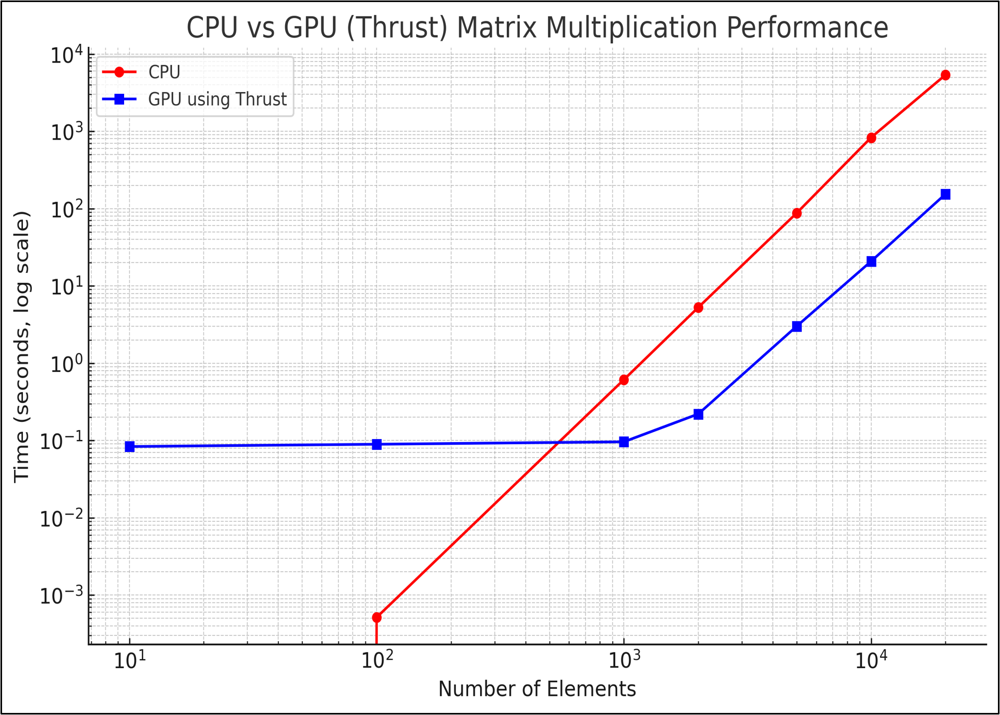
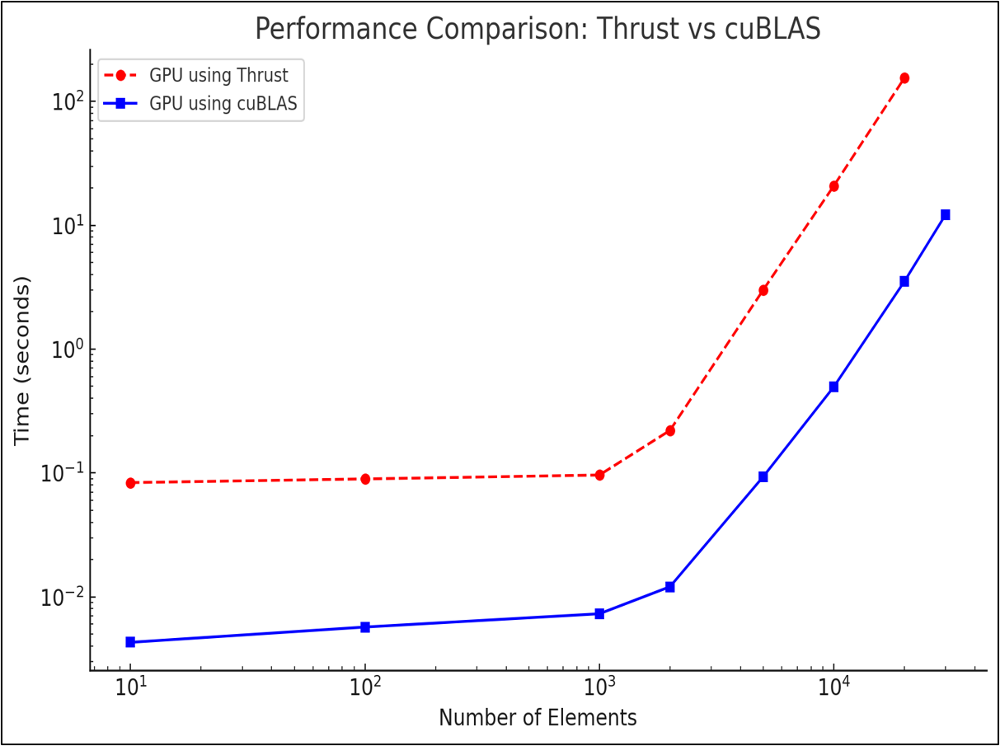

# CUDA Matrix Multiplication (cuBLAS vs Thrust)

## Overview
This project implements matrix multiplication on GPU using two different approaches:

- **cuBLAS**: NVIDIA's highly optimized linear algebra library  
- **Thrust**: High-level parallel programming library  

The goal is to compare performance and implementation complexity between optimized libraries and custom parallel approaches.

---

## Features
- GPU-based matrix multiplication using CUDA  
- Implementation using cuBLAS and Thrust  
- Performance comparison between CPU and GPU  
- Demonstrates parallel computation techniques  

---

## Technologies Used
- CUDA  
- C++  
- cuBLAS  
- Thrust  

---

## Project Structure

src/

├── cublas_matmul.cu

└── thrust_matmul.cu


---

## How to Compile

Make sure CUDA Toolkit is installed.

### Compile cuBLAS version
```bash
nvcc src/cublas_matmul.cu -lcublas -o cublas_matmul
```

### Compile Thrust version
```bash
nvcc src/thrust_matmul.cu -o thrust_matmul
```

## How to Run
```bash
./cublas_matmul
./thrust_matmul
```
## Performance Results

### CPU vs GPU (Thrust)



- GPU significantly outperforms CPU as input size increases
- CPU execution time grows rapidly due to serial computation
- GPU achieves better scalability due to parallelism

---

### Thrust vs cuBLAS



- cuBLAS consistently outperforms Thrust
- Thrust provides flexibility but lacks low-level optimization
- cuBLAS leverages optimized GPU kernels for superior performance

---

## Numerical Comparison

| Number of Elements | GPU (Thrust) | CPU |
|------------------|-------------|-----|
| 10               | 0.0835      | 0.004286 |
| 100              | 0.0894      | 0.005694 |
| 1000             | 0.0961      | 0.007288 |
| 2000             | 0.2203      | 0.012051 |
| 5000             | 3.006       | 0.093296 |
| 10000            | 20.797      | 0.495761 |
| 20000            | 154.454     | 3.51636 |

---

These results demonstrate the scalability of GPU-based computation and highlight the performance advantages of optimized libraries such as cuBLAS.

## Key Takeaways

- GPU acceleration significantly improves performance for large-scale matrix operations
- cuBLAS provides the best performance due to optimized implementations
- Thrust offers ease of use but lower performance
- Efficient computing requires both algorithmic design and hardware awareness


## Learning Outcomes
- Understanding GPU parallelism
- Using cuBLAS for optimized computations
- Comparing different GPU programming approaches
- Performance benchmarking in CUDA

## Author
Mehul Kapoor
